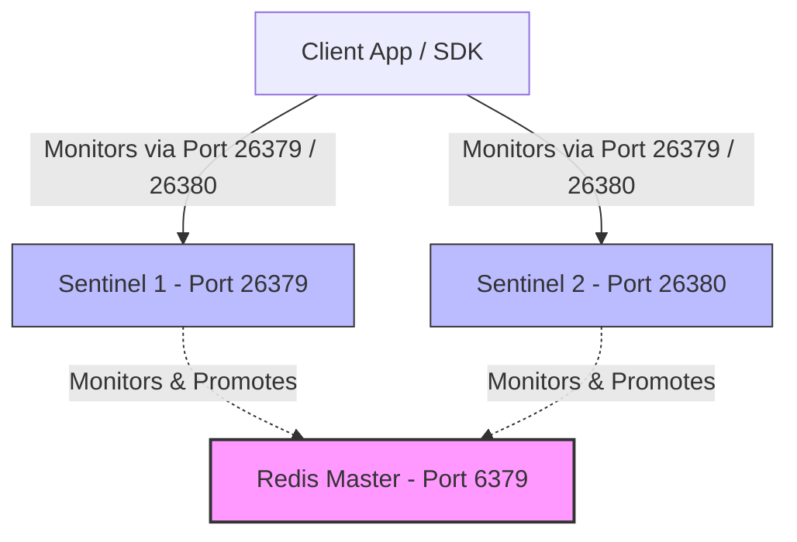

# Redis Sentinel Local Configuration for macOS (Homebrew)

[](LICENSE)
[](.github/workflows/shellcheck.yml)
[](https://redis.io)
[](https://apple.com)

A production-parity, fully automated local **Redis Sentinel** clustering environment for macOS developers. Built on top of **Homebrew Redis**, this repository provides configurations, control scripts, and troubleshooting guides to run a multi-sentinel replication cluster locally.

---

## 🔍 Why Redis Sentinel Locally?

Developing high-availability systems requires local environments that mirror production behavior. This setup allows you to test:
- Automatic failover and master promotion.
- Application-level Sentinel client reconnects (`redis-sentinel` clients).
- Resiliency scenarios by killing the master node and watching Sentinels elect a new master.

---

## 🏗️ Architecture Layout

This setup configures a master Redis instance alongside two Redis Sentinel instances monitoring it, requiring a quorum of 1 for master failure detection and failover promotion.



- **Redis Master Node**: Running on default port `6379` (managed by Homebrew or manual script).
- **Sentinel Node 1**: Running on port `26379` (quorum of 1).
- **Sentinel Node 2**: Running on port `26380` (quorum of 1).

---

## 🚀 Quick Start Guide

### Prerequisites

Ensure you have **Homebrew** installed and Redis installed:
```bash
brew install redis
```

### Installation

1. **Clone the repository and enter the directory**:
   ```bash
   git clone https://github.com/melvincarassco/redis-sentinel-local.git
   cd redis-sentinel-local
   ```

2. **Run the installation script**:
   This script creates the run directories under `~/redis-sentinel/` and copies the Sentinel configuration files.
   ```bash
   chmod +x scripts/*.sh
   ./scripts/install.sh
   ```

3. **Start the primary Redis server**:
   ```bash
   brew services start redis
   # OR run manually:
   # redis-server /opt/homebrew/etc/redis.conf
   ```

4. **Start the local Sentinels**:
   ```bash
   ./scripts/start.sh
   ```

5. **Verify the cluster status**:
   ```bash
   ./scripts/status.sh
   ```

---

## ⚙️ Environment Variables Config

Integrate your backend application (Node.js, Go, Python, Spring Boot) with the local cluster using these variables:

```env
# Enable Sentinel Client connection pool
REDIS_USE_SENTINEL=true

# Standalone Master fallback parameters
REDIS_HOST=127.0.0.1
REDIS_PORT=6379
REDIS_DB=0

# Sentinel Addresses (comma-separated list of Host:Port)
REDIS_SENTINEL_HOSTS=127.0.0.1:26379,127.0.0.1:26380

# The master group name as monitored in configuration files
REDIS_MASTER_NAME=billing-master
```

---

## 🛠️ Management Commands

Manage your Sentinels using the included shell scripts:

- **Start Sentinels**: `./scripts/start.sh` (Runs sentinel processes in the background using `redis-server --sentinel`).
- **Stop Sentinels**: `./scripts/stop.sh` (Terminates running Sentinel instances gracefully).
- **Check Status**: `./scripts/status.sh` (Pings standard Redis port 6379, Sentinel 26379, and Sentinel 26380).

---

## 🩺 Troubleshooting & Failure Testing

To verify failover behavior:
1. Kill the primary master: `brew services stop redis` or `pkill redis-server`.
2. Inspect Sentinel logs or status: `redis-cli -p 26379 sentinel masters`.
3. Read the [Detailed Troubleshooting Guide](docs/troubleshooting.md) for ports, binding issues, and LaunchAgent automation details.

---

## 🏷️ Keywords & Search Tags
`redis-sentinel` `macos-redis` `local-redis-sentinel` `high-availability` `redis-failover` `redis-replication` `homebrew-redis` `local-development`
